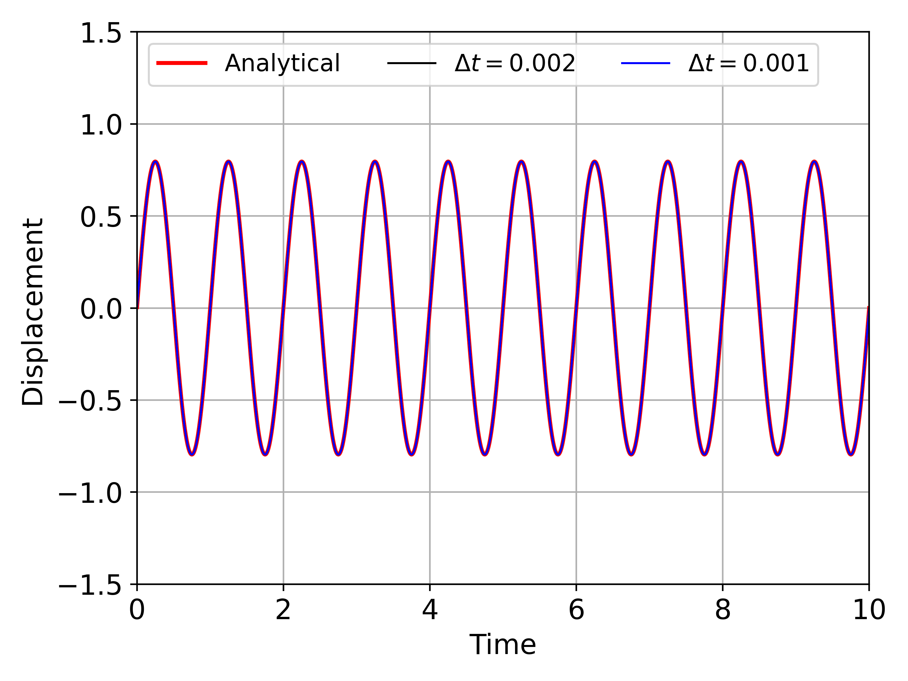
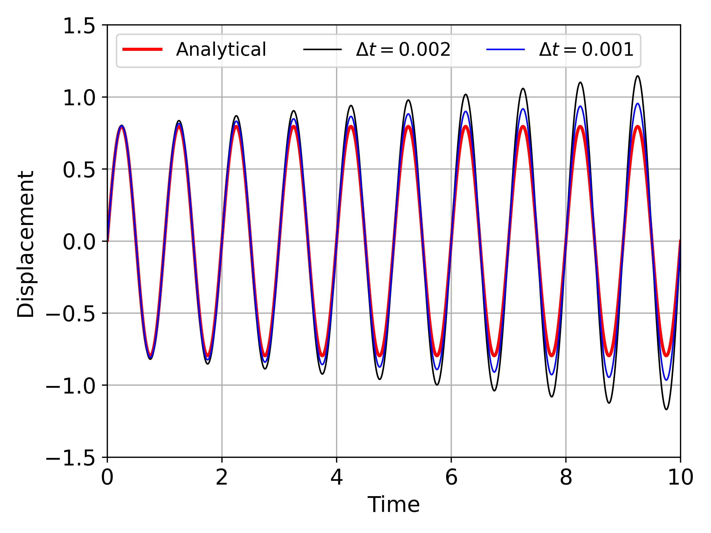

# OpenFOAMsixDOFtest

For solving six DOF rigid body problems in OpenFOAM, three different time integration schemes are available in OpenFOAM. They are

1. Symplectic scheme
2. Newmark scheme
3. Crank-Nicolson scheme

However, of the three, only Symplectic scheme produces correct results. The current implementations of Newmark and Crank-Nicolson schemes are incorrect.

To test the schemes, a circular cylinder supported on a spring and damper in transverse (Y-) direction is considered. The fluid velocity and pressure are zero so that the force exerted by the fluid on the cylinder is zero. The initial velocity is taken as 5. The graphs below show the displacement values obtained with different schemes for two different time steps, 0.002 and 0.001. OpenFOAM case files are available in the repository.

### Symplectic scheme

### Newmark scheme

### Crank-Nicolson scheme

The primary reason for this behaviour, after going through the source code, is due to all of the schemes being implemented as explicit schemes in which the acceleration is solved first and then displacement and velocity are calculated later. Such an approach does not work for Newmark and Crank-Nicolson schemes as they are not truly explicit schemes, particularly for problems with non-zero damping.

The Newmark scheme can be made to be explicit but only for `beta=0.0`, and the implementation needs to be modified. The correct implementation of the explicit Newmark method is given in the Python script `Newmark-beta-explicit.py`.

